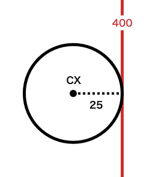

## 前回のおさらい 1/4

### 変数とは
- **名前（ラベル）の付いた容れ物**。
- **どんな値（数, 文字列）でも一つだけ入れられる。**
- 入れた**値を後から変える**こともできる。
  - 値を増やす / 減らす
  - 別の値で上書きする、など

---

変数を使うには、先に **宣言** をする必要がある。

```js
let 変数名 = 初期値;
```

```js
var 変数名 = 初期値; // let の代わりに var でも可だが、非推奨。
```

変数名は *自由*（ただし半角英数）。**自分がわかりやすい名前**をつけよう。

```js
let color = 'blue'; // 色
let iro   = 'blue'; // ローマ字表記でも自分がわかれば OK
let iro1  = 'red';  // 数字をつけて区別するのも良い
let iro2  = 'pink';
```

---

変数の値を変えるには **代入文** を使う。

```js
変数名 = 値A; // 値:A を代入
変数名 = 値B; // 値:B で上書き
```

**`let`, `var` は宣言時のみ**に用い、代入文では使用しない。
また、宣言が必要なのは*最初の一回のみ*。
宣言をすることで容れ物が用意される、というイメージ。

---

変数に入れる値は、**数値** ならそのまま記述（ただし半角で）。

```js
number = 120;  // 変数:number に 120 を代入
number = 3.14; // 小数点を含む数も OK
```

数値ではなく **文字列** を入れる場合は
**`'`<small>（シングルクオート）</small> か `"`<small>（ダブルクオート）</small>で文字列を囲む**。

```js
text = 'ABC あいうえお 123'; // 変数:text に文字列を代入
text = "ABC あいうえお 123"; // ダブルクオートでも OK
```

*クオートは必ず半角*を用いること。

<hr>

`'` の入力方法: `Shift` + `7`
`"` の入力方法: `Shift` + `2`

---

## 前回のおさらい 2/4

### 四則演算
数値を用いて **足し算**, **引き算**, **掛け算**, **割り算** ができる。

```js
number = 1 + 2; // number = 3   (足し算)
number = 3 - 4; // number = -1  (引き算)
number = 5 * 6; // number = 30  (掛け算)
number = 8 / 4; // number = 2   (割り算)
```

*`()` の中の式は優先*して計算される。
```js
number = (1 + 2) * (3 - 4); // number = 3 * -1
                            // number = -3
```

---

**変数を計算式に含める**ことも可能。

```js
let x = 2;
let y = x + 1; // y = 2 + 1 = 3
let z = x * y; // z = 2 * 3 = 6
```

例: 一つの変数値を**相対的に増減**させる。

```js
let money = 1000;          // 所持金　　　　　　 = ¥1,000
money = money + 3000;      // お小遣い3000円 　 = ¥4,000
money = money - (70 * 2);  // ガリガリ君二本購入 = ¥3,860
```

---

変数を相対的に増減させる場合、
以下のような**短縮記法**が利用できる。

```js
x = x + 5; // x を 5 増やす
x += 5;    // x を 5 増やす（短縮記法）
```

```js
x = x * 2; // x を 2 倍する
x *= 2;    // x を 2 倍する（短縮記法）
```

```js
x = x / 2; // x を半分にする
x /= 2;    // x を半分にする（短縮記法）
```

---

**1 増やす**、または **1 減らす**場合にのみ利用できる、特別な短縮記法が存在する。

```js
x = x + 1; // x を 1 増やす
x++;       // x を 1 増やす（短縮記法）
```

```js
x = x - 1; // x を 1 減らす
x--;       // x を 1 減らす（短縮記法）
```

`++` は*インクリメント (increment)*、
`--` は*デクリメント (decrement)* と呼ぶ。

---

**文字列**の演算は**足し算のみ**可能。
文字列を足し算すると、**連結されて一つの文字列になる**。

```js
let animal = '牛';
let number = 2;

let text = '君は';
text = text + animal + 'を' + number + '頭';
text = text + '持っている。'; // text = '君は牛を2頭持っている。';
```

---

## 前回のおさらい 3/4

### モノを動かすには
プログラムで物体が動いているように見せるには、
**物体の表示位置を、フレーム毎に少しづつ変化させればよい**。

<hr>

具体的には、まず**物体の表示位置に変数を指定する**。

```js
let x = 200; // 変数 x の宣言
let y = 200; // 変数 y の宣言
function draw() {
  circle(x, y, 10); // x, y 位置に円を描画
}
```

---

あとは、`draw()` 関数が*毎秒 60 回*実行されることを利用し、
**表示位置を担う変数を、動かしたい方向に増減**させればよい。

```js
let x = 200; // 変数 x の宣言
let y = 200; // 変数 y の宣言
function draw() {
  x += 2; // x を毎フレーム 2 づつ増やす
  y -= 1; // y を毎フレーム 1 づつ減らす
  circle(x, y, 10); // x, y 位置に円を描画
}
```

増減させる幅を大きくすれば、物体の動きは速くなり、
小さくすれば遅くなる。

---

## 前回のおさらい 4/4

### 関数は働き者
- 関数とは、**好きな時に呼び出せて**、**特定の仕事をしてくれる** 使い走り。
- 関数はそれぞれ **名前** と **仕事** を持っていて、
  *名前を呼ぶ* ことでその仕事を実行させることができる。
- `alert()` や `circle()` などの命令も関数。

関数の呼び出し方:

```js
関数名();         // パラメタ無しの場合
関数名(パラメタ);   // パラメタ有りの場合
```

---

### 関数の引数
関数を呼び出す際、**引数（パラメタ）** を渡すと、
*渡した値<small>（数値や文字列）</small>によって仕事の結果が変わる*。

```js
alert('こんにちは。'); // "こんにちは。" と出力
alert('おはよう。');   // "おはよう。" と出力
```

*複数の引数* を渡す場合は **`,` 区切りで列挙** する。

```js
circle(200, 200, 12); // 座標:(200, 200)に直径:12の円を描画
```

---

### 関数の自作
用意された関数を使うだけではなく、
**オリジナルの関数を作る（定義する）** こともできる。

*関数の定義の仕方:*

```js
function 関数名(引数名) {
  // 仕事の内容（ここにコードを書く）
}
```

`関数名`, `引数名` は自由<small>（半角英数）</small>。引数は不要なら省いてもよい。
*`{ }` 内に書いたコードが関数の仕事の内容*となり、
**その関数を呼び出さない限り実行されることはない**。

よく使う処理を関数化しておき、必要に応じて呼び出すようにすれば、
**コード全体がすっきりして読みやすくなる**。

---

# p5.js 編集環境を整える

---

### [p5js.org](https://p5js.org/) にアカウントを作る
[p5js.org](https://p5js.org/) にユーザー登録することで、
編集中のスケッチをウェブ上に保存することができるようになる。

ログインさえできれば **どのPC** からでも編集作業を続きを行うことができるし、
スケッチの共有も容易になる。

---

### p5.js エディタ :: メニューの使い方
- スケッチを新規作成するには `File > New`
    - 新規作成されたスケッチには自動でランダムな名前が付く。
    - **鉛筆アイコン** をクリックすれば自分で名前を付けられる。
- 作ったスケッチを開くには `File > Open`
- `<` ボタンをクリックすると `Sketch Files` メニューが開く
    - `Sketch Files > Upload file` で画像などの素材をアップロードできる。

---

### p5.js エディタ :: ショートカットキー
| キー | 機能 | 備考 |
|:---|:---|:---|
| `⌘` + `Shift` + `F` | コードの自動整理 | コード全体のインデントやスペースなどを<br>自動で整えてくれる機能。 |
| `⌘` + `Enter` | スケッチの実行 |  |
| `⌘` + `Shift` + `Enter` | スケッチの停止 |  |
| `⌘` + `S` | スケッチの保存 | [p5js.org](https://p5js.org/) のサーバーに保存される。 |

---

# モノに当たり判定をつけよう

---

前回の講義では、**変数**を利用することで*図形の位置や大きさを変化させるアニメーション*を実装することができた。

ここで復習も兼ねて、もう一度最初からコードを書いてみよう。
p5.js エディタをブラウザで開き、次のようなアニメーションを実装してほしい。

> 座標 *(0, 200)* から、
> 1 フレーム *10px* の速度で*右*に動く、
> 直径 *50px* の円

---

アニメーションが正しく実装できていれば、
円はすぐに*キャンバスの右端を通り過ぎ、見えなくなってしまう*はずだ。

この円は画面から消えてしまった後も、
*プログラムを停止しない限り永遠に右に移動し続ける*。
そして、どれだけ待とうがこの画面に再び現れることはない。
<small>宇宙空間を永遠に彷徨う羽目になったカーズと同じ運命を辿ることは免れそうにない。</small>

円の動きを止めることなく**画面から消えないようにする**にはどうすれば良いだろう？

---

この問題に対する回答として、極めて簡明かつ良く知られた手法が存在する。

<figure class="video">
<iframe width="560" height="315" src="https://www.youtube.com/embed/5mGuCdlCcNM?si=r1Yf3Gjai2n5OT1U" title="YouTube video player" frameborder="0" disablekb="1" allow="accelerometer; autoplay; clipboard-write; encrypted-media; gyroscope; picture-in-picture; web-share" referrerpolicy="strict-origin-when-cross-origin" allowfullscreen></iframe>
<figcaption>DVD スクリーンセーバー</figcaption>
</figure>

[ウェブ版 (www.bouncingdvdlogo.com)](https://www.bouncingdvdlogo.com/)

---

要するに、*動く円がキャンバスの端に到達した際*、
**反対側に跳ね返るように方向転換**させれば良いのだ。

キャンバスを無限の宇宙空間ではなく、**壁で囲まれた部屋**にしてしまえばいい。

---

# 「壁」を定義する

---

ではまず、*右に動く円が、キャンバスの右壁に当たる*瞬間を想像してみよう。
**円が右壁に接触している状況**とは、具体的に**どのような条件**を指して言えるだろうか？

---

キャンバスサイズが 400 x 400 の場合、
右壁はキャンバスの右端である **X 座標 400 に位置する、垂直の縦線**とイメージできる。
壁の高さはキャンバスの高さと同じ 400px だが、実質的に無限大と考えて構わない。

すると、先ほどの「*円が右壁に接触している条件*」とは、
「*円の右端が、この縦線と接している状態*」、つまり
「**円の右端の X 座標が 400 の時**」と定義することができそうだ。

---

<!-- _class: left -->

円の右端は、*円の中心から右に 1 半径分ずれた位置*にある。
円の直径は 50px なので、半径は 25px となる。
円の中心の X 座標を *CX* とするなら、
「*円の右端の X 座標が 400 の時*」とは

```js
CX + 25 = 400
```

このような式で表すことができる。



---

これで「**円が右壁に接触している条件**」
を定義することはできた。

次はこの条件を実際のプログラムに落とし込んでいこう。

---

# 条件分岐

---

- *物体が壁に接触していたら*跳ね返る。
- *体力がゼロになったら*ゲームオーバー。
- *経験値が一定値以上になると*レベルアップ。
- *残高が足りないと*商品が購入できない。
- *パスワードが正しくないと*ログインできない。
- *文字数が多すぎると*投稿できない。

プログラムにおいて、
**特定の条件によって処理内容を変えたい**という場面は枚挙に暇がない。
これらを**条件分岐** と呼ぶ。

---

## `if` 文
JS で条件分岐を行うには次のように書く。

```js
if (条件式) {
  // 処理内容（ここにコードを書く）
}
```

`()` 内に書かれた `条件式` が **正しい** なら `{ }` 内のコードが実行される。
逆に、`条件式` が **正しくない** のなら `{ }` 内は実行されない。

<hr>

条件式が「正しい」状態を **真 (True)** と呼ぶ。
逆に、「正しくない」状態は **偽 (False)** と呼ぶ。
そして、これら二つの状態をまとめて **真偽値 (Boolean)** と呼ぶ。

---

### 条件式の書き方
条件式は基本的に、**二つの値を比較する式** で成り立っている。
比較方法には様々なパターンが存在する。

以下に示すのは、**二つの変数 `x` と `y`** を様々な方法で比較した場合の
条件式の記述例である。

```js
if (x < y) {  }  // x が y よりも小さければ 真
```

```js
if (x > y) {  }  // x が y よりも大きければ 真
```

---

`=（イコール）` 記号を含む条件式:

```js
if (x == y) {  }  // x が y と等しければ 真
```

```js
if (x != y) {  }  // x が y と等しくなければ 真
```

```js
if (x <= y) {  }  // x が y 以下なら 真
```

```js
if (x >= y) {  }  // x が y 以上なら 真
```

<hr>

`x` と `y` の間にある記号は **比較演算子** と呼ぶ。

---

`if` 文による条件分岐を使用した簡単なサンプルコードを用意したので、
コードを分析してみよう。

サンプルコード:
https://editor.p5js.org/amekusa/sketches/_ZkFbyn64

---

# 「壁」を実装する

---

<!-- _class: left -->

これで「*円が壁に当たって跳ね返る*」処理を実現するための道具は揃った。

「**円が右壁に接触している条件**」を表す式を
思い出してみよう。

```js
CX + 25 = 400
```

この式を `if` 文の `条件式` に当てはめて書き表すと、

```js
if (CX + 25 == 400) {

}
```


---

#### 演習:
`if` 文を活用したスケッチを描いてみよう。
（質問, アドバイス受け付けます。）

---

サンプルコード:
https://editor.p5js.org/amekusa/sketches/_CnF4qQTW

参考書籍内のサンプルコード:
http://www.bnn.co.jp/support/generativedesign_p5js/
