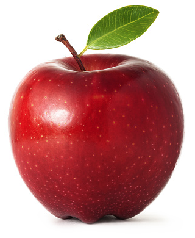

## 前回のおさらい 1/1

### 条件分岐（ `if` 文 ）
ある**特定の条件**を満たした場合にのみ実行させたい処理がある場合、
`if` 文で条件分岐を行う。

```js
if (条件式) {
  // 実行内容
}
```

`()` 内に書かれた `条件式` が **正しい** なら `{ }` 内のコードが実行される。
逆に、`条件式` が **正しくない** のなら `{ }` 内は実行されない。

---

### 真偽値
条件式が「正しい」状態を **真 (true)** と呼ぶ。
逆に、「正しくない」状態は **偽 (false)** と呼ぶ。
そして、これら二つの状態をまとめて **真偽値 (Boolean)** と呼ぶ。

---

#### 条件式の記述例
```js
if (x < y) {  }  // x が y よりも小さければ 真
if (x > y) {  }  // x が y よりも大きければ 真
```

`=（イコール）` 記号を含む条件式:

```js
if (x == y) {  }  // x が y と等しければ 真
if (x != y) {  }  // x が y と等しくなければ 真
if (x <= y) {  }  // x が y 以下なら 真
if (x >= y) {  }  // x が y 以上なら 真
```

---

# 繰り返し処理

---

### （突然ですが）線を一本引いてみよう。
線を引くには [`line`](https://p5js.org/reference/p5/line/) 関数を使う。

```js
function draw() {
  // 座標(200, 100) から (200, 300) へ線を引く
  line(200, 100, 200, 300);
}
```

---

### 線を増やそう
今度は 10px 右にずらして、一本目と平行な線を引こう。

```js
function draw() {
  line(200, 100, 200, 300); // 一本目
  line(210, 100, 210, 300); // 二本目
}
```

一本目をコピー＆ペーストして、パラメタを少し変えれば簡単だ。
同じやり方で、平行線を*あと三本*ほど追加してみほしい。

このような数本の平行線を描くだけのプログラムであれば、
数秒で書きあげることができるはずだ。

---

## では「100 本の線を引け」と言われたらどうする？ :thinking:

---

## “*Don't Repeat Yourself.*”
`line()` 関数の呼び出しを 100 本分コピー＆ペーストし、一つ一つパラメタを調節すれば確かにこの要望は満たせるが、このやり方には*いくつかの重大な落とし穴*が存在する。

- もし、パラメタの数値を打ち間違ったら？（ヒューマンエラーの可能性）
- もし、後から線と線の間隔を変更したくなったら？（仕様変更の可能性）

プログラムを動かすのはコンピューター、つまり機械だが、
*プログラムを書くのも設計するのも我々、つまり人間である*。
人間が神のような完璧な存在ではないがゆえ、上記の「*もし*」は**必ず起こる**ものなのだ。
そして、それが起きた際に発生し得る*修正作業の量*は、
*コピー＆ペーストを繰り返した回数に概ね比例*するだろう。

---

このような*単純作業の繰り返しがプログラマーの本分と言えるだろうか？*
このような類の仕事を、*我々よりも遥かに得意とする味方*が、今あなたの目の前にいるというのに！
コンピューターとは、正にこのような目的のために人間が発明した機械であり、
コンピューターに**仕事を命令する**のがプログラマーの本分である。

> “*Don't Repeat Yourself.*”
> 「繰り返すのはあなた（プログラマー）ではない。」
>
> 参照: https://e-words.jp/w/DRY%E5%8E%9F%E5%89%87.html

---

# ループ構文
プログラムに**同じ処理を複数回**実行させるために、
どんなプログラミング言語にもほぼ必ず存在するのが「**ループ構文**」だ。
これから JavaScript におけるループ構文を解説していく。

---

## `for` 文
**`for` 文** は、特定の処理を**決められた回数だけ繰り返し**実行させたい際に用いられるループ構文だ。

#### 書き方:
```js
for (let i = 0; i < ループ回数; i++) {
  // 実行したい処理
}
```

`ループ回数` に `100` と入れれば、`{ }` 内に書いたコードが 100 回実行される。

---

### `for` 文を紐解く
`for` に続く `( )` の中に注目してほしい。

```js
for (let i = 0; i < 100; i++) {
```

この `( )` の中身は `;`<small>（セミコロン）</small>を挟んで、以下の **3 つのパート** に分けられる。

<div class="cols gap">

<div>

```js
let i = 0
```

1. 左
</div>
<div>

```js
i < 100
```

2. 中央
</div>
<div>

```js
i++
```

3. 右
</div>

---

プログラムが `for` の行に到達すると、*最初に左のパートが一回だけ実行*される。

```js
let i = 0  // 左: 変数 i の宣言
```

中央は *条件式* で、**ループを継続するか否かの条件判定** を行っている。

```js
i < 100    // 中央: i が 100 より小さければループ継続
```

右は **ループ毎に一回実行** される。

```js
i++        // 右: i を 1 増やす
```

---

変数 `i` は **ループ回数を数えるための変数** でループカウンターと呼ぶ。
ループを実行する度に `i` は 1 増えてゆき、
100<small>（ループ回数）</small>に到達した時、条件式が *偽 (False)* になるため、
そこでループは終了する。

---

まとめると、

| 実行順 | 内容 |
|:---:|:----|
| 1. | `for` の行に到達 |
| 2. | <small>左のパート:</small> ループカウンタの宣言 |
| 3. | <small>中央パート:</small> 条件判定（条件に合致しなければ `for` 文を終了する） |
| 4. | `{ }` 内の処理の実行 |
| 5. | <small>右のパート:</small> ループカウンタに +1 |
| 6. | 3. に戻る |

---

ちなみに、
ループカウンターの変数名が **`i`** である必要は**特にない**。
ただの変数名なので実は**何でもいい**。

とはいえ**慣習的**に `i` が使われることが多い。何故 `i` なのかというと、
**iterator（イテレーター, 反復子）** の頭文字に由来する。

---

### 演習:
`for` 文を使って、**縞模様** を描いてみよう。
（質問、アドバイス受け付けます。）

---

# 高度な条件分岐

---

### `else` 句
`if` 文を使い条件分岐が行えることを学んだ。
`if` 文の直後に **`else`** 句を付帯させると、
逆に、**条件に合致しなかった場合** に実行させるコードを記述することができる。

---

### `else` 句の書き方<small>（例）</small>
```js
if (x < y) {
  // 真 の場合
  alert('X は Y より小さい。');

} else {
  // 偽 の場合
  alert('X は Y より小さくない。');
}
```

上記のコードは、
`x < y` が *真 (true)* なら上の `alert` が実行され、
`x < y` が *偽 (false)* なら下の `alert` が実行される。

---

`else` 句は、必ず **`if` 文の直後に付帯**するもので、
**`else` 句単体で記述することはできない**。

```js
// これは構文エラー
else {

}
```
```js
// これは OK
if (a == b) {

} else {

}
```

---

### `else if` 句
`else if` 句で、**さらに条件分岐を追加** することもできる。

```js
if (x < y) {
  alert('X は Y より小さい。');

} else if (x > z) {
  alert('X は Y より小さくない。');
  alert('X は Z より大きい。');
}
```

この場合、最初の `if` が *偽 (false)* の時のみ、
`else if` の条件判定が行われる。

どちらの条件にも合致しなかった場合は、何も実行されない。

---

複数の `else if` を繋げて、
**3つ以上の条件分岐** をつくることも可能。
```js
if (pet == 'dog') {          // 分岐:1
  alert('🐶 ワン');

} else if (pet == 'cat') {   // 分岐:2
  alert('🐱 ニャー');

} else if (pet == 'mouse') { // 分岐:3
  alert('🐭 チュー');

} else { // いずれの条件も満たさなかった場合
  alert('❓❓❓');
}
```

サンプルスケッチで確認してみよう。
https://editor.p5js.org/amekusa/sketches/3YAjHkOI-

---

# オブジェクト (object)
プロパティで表現される、バーチャルな “モノ”

---

“モノ” は**単一の数値**では表現できない。
どんなに単純な物体でも
色, 形, 大きさ, 重さ
といった、**複数の様々な情報から成り立っている**。



---

そのような “モノ” を JavaScript で表現するには
**オブジェクト (object)** というデータ型を用いるのがよい。

（データ型とは、数値や文字列といった値のタイプ（種類）のこと。）

---

オブジェクトは通常、**1つ以上の属性（プロパティ）** から構成されており、
このような書式で定義することができる。

```js
{
  プロパティA: 値,
  プロパティB: 値,
  プロパティC: 値
}
```

プロパティ名は自由だ。<small>（ただし半角英数を推奨）</small>

---

例として :apple: をオブジェクトとして定義してみよう。

```js
let apple = {
  color:  'red', // 色
  size:   11,    // 大きさ (cm)
  weight: 400    // 重さ (g)
};
```

このコードは、
`color`, `size`, `weight` という**三つのプロパティで構成される一つのオブジェクト**
を定義し、それを変数 `apple` に代入している。

---

**オブジェクトとプロパティ** の関係性は、
ゲームの **キャラクターとステータス値** の関係性に近い。例えばこのように。
```js
// オブジェクト: プレイヤーキャラクター
let player = {
  name: 'John',  // 名前
  sex:  'male',  // 性別
  lv:     30,    // レベル
  exp:  1024,    // 経験値

  hp:    128,    // 体力
  str:    99,    // ちから
  agl:     8,    // 素早さ
  fth:    99,    // 信仰心
};
```


---

これまで、物体の描画位置やサイズなどの情報を表現する際、

```js
let x = 10;    // 円の x 座標
let y = 20;    // 円の y 座標
let size = 50; // 円の直径
```

このように *複数の変数* を使用してきたが、
オブジェクトを利用することで...

```js
// 円オブジェクト
let ball = {
  x: 10,    // x 座様
  y: 20,    // y 座標
  size: 50, // 直径
};
```

このように、各情報をオブジェクトのプロパティとしてまとめることができる。

---

オブジェクトのプロパティにアクセスするには、

```js
alert('ようこそ！ ' + player.name + 'さん'); // 'ようこそ！ Johnさん'
```

このように、`変数.プロパティ名` と書けばよい。
それ以外のルールは **変数と全く同じ** なので、
*プロパティの値を増減させたり上書きすることが可能* である。

```js
player.lv++; // レベルアップ
```

```js
let dmg = 256;
player.hp = player.hp - dmg; // プレイヤーに 256 のダメージ
```

---

先ほどの円オブジェクトを `circle()` 関数で描画するなら、以下のようになる。

```js
// 円オブジェクト
let ball = {
  x: 10,    // x 座様
  y: 20,    // y 座標
  size: 50, // 直径
};

// 描画
circle(ball.x, ball.y, ball.size);
```

---

また、プロパティは **後から追加** しても問題ない。

```js
let ball = {};  // 空のオブジェクトを作成
ball.x = 10;    // プロパティ x を追加
ball.y = 20;    // プロパティ y を追加
```

---

サンプルスケッチを確認してみよう。
`04/balls.js` https://editor.p5js.org/amekusa/sketches/UulZcFAl-


改造版:
`04/bouncy-balls.js` https://editor.p5js.org/amekusa/sketches/_AV0PDuJr

---

### 演習:
サンプルスケッチをコピーし、
改造して面白い動きをつけてみよう。

---

# 配列 (array)

---

第二回目の講義で、
変数は **「値を一つだけ保存できる容れ物」** のようなものだと説明した。

先ほどのサンプルスケッチ内の**変数 `ballA`, `ballB`** のように、
**2 個のオブジェクトが必要なら 2 つの変数**を用意する必要がある。

---

もし同じ方法で **3 個目のボール**が欲しくなったら、
我々はさらに **変数 `ballC`** を用意しなくてはならない。

だが *“Don't Repeat Yourself”* の原則に立ち返るならば、
これは美しい解決方法とは言えない。

そこで **配列 (array)** の出番となる。

---

配列とは *特殊なオブジェクトの一種*で、
**複数の値を、それぞれに番号を振って格納, 管理**することのできる構造体である。

---

*貨物列車* をイメージしてほしい。
先頭の貨物は `0` 番で、その次は `1` 番, その次は `2` 番... という具合に、
**各貨物には連番が振られている。**
<figure>
<div class="array">
  配列
  <div class="item a">0番: 値A</div>
  <div class="item b">1番: 値B</div>
  <div class="item c">2番: 値C</div>
</div>
<style scoped>
.array {
  display: flex;
  gap: 1em;
  align-items: center;
  justify-content: center;
  padding: 1em;
  /* background: hsl(40, 80%, 90%); */
  border: 1px dashed #0008;
  font-family: Menlo, Monaco, monospace;
}
.item {
  padding: .5em 1em;
}
.item.a {
  background: hsl(0, 90%, 80%);
}
.item.b {
  background: hsl(90, 90%, 80%);
}
.item.c {
  background: hsl(180, 90%, 80%);
}
</style>
<figure>

そして、各貨物には一つづつ **値** を入れることができる。
貨物はそれぞれが **変数** のようなものだとも言える。

変数との違いは、**名前ではなく番号でアクセスする** という点だ。

---

配列を定義するには、

```js
[値A, 値B, 値C]
```

このように `[ ]` の中に **`,（カンマ）` 区切り**で値を列挙する。

```js
let list = ['Alice', 'Bob', 'Charles'];
```

この例では、**変数 `list`** に
**三つの文字列 `Alice`, `Bob`, `Charles` が入った配列** を代入している。

---

先ほどは "貨物" と例えたが、
配列に格納されている一つ一つの値は、正式には **要素 (element)** と呼び、
**番号を指定** してそれぞれの要素にアクセスすることができる。

```js
alert( list[0] ); // "Alice"
alert( list[1] ); // "Bob"
alert( list[2] ); // "Charles"
```

`[ ]` の数字が番号で、**`0` から始まる連番**となっている。
この番号は **添字（インデックス）** と呼ぶ。

---

ちなみに、値の列挙時に改行を挟んでも問題ない。
長い配列を定義する際は**読みやすさ**を心がけよう。

```js
// NATO フォネティックコード
let list = [
  'Alfa',
  'Bravo',
  'Charlie',

  'Delta',
  'Echo',
  'Foxtrot'
];
```

---

配列に**後から要素を追加**することも可能だ。
**`push()` 関数**を使うと、**配列の最後尾**に新しい要素を追加できる。

```js
list.push('Golf'); // Foxtrot の次
```

また、**`length` プロパティ** を参照することで、
*その配列内の要素の総数* を知ることもできる。

```js
alert( list.length ); // 7
```

---

### 配列をループで回そう
ここまで内容では配列の利点がこれといって思いつかないかもしれないが、
**添字で個々の要素にアクセスできる**という性質が
**`for` ループ**と組み合わせた時に**真価**を発揮する。

---

サンプルコードを確認しよう。
`04/array.js` https://editor.p5js.org/amekusa/sketches/_Y5ai80fH

---

早速、配列と `for` ループを駆使し、
2 個だったボールを **24 個** に増やしてみた。
コードと動作を確認してみてほしい。
`04/bouncy-balls-2.js` https://editor.p5js.org/amekusa/sketches/FIM3H8feO

---

## 演習:
サンプルコードを参考にしながら、
- オブジェクト (object)
- 配列 (array)
- `for` ループ

を駆使し、**動くアート**を作ってみよう。

---

# Appendix: 役に立つ関数, 変数

---

```js
random(最小値, 最大値);
```

`最小値` から `最大値` までの間で、ランダムな数値<small>（乱数）</small>を生成する。
生成された数値を *変数に入れたり*、
*別の関数の引数として利用* したりすることができる。

用例:
```js
let size = random(50, 60);
circle(10, 20, size);  // 50〜60 までのランダムなサイズ
```

---

```js
translate(X, Y);
```

描画原点をずらす関数。
通常、描画原点<small>（座標: 0, 0）</small>はキャンバスの左上に設定されているが、
この関数を呼ぶことで、引数の `X`, `Y` 分だけ描画原点をずらすことができる。
`circle()` や `text()` といった*全ての描画命令*は、この影響を受ける。
**キャンバスそのものをずらす** というイメージに近い。

用例:
```js
translate(100, 200);
circle(0, 0, 50); // 位置: 100, 200 に円描画
```

---

```js
push();
```

キャンバスの状態を一時的に保存する。
`translate()` 関数でずらしたキャンバスの位置も保存される。

<hr>

```js
pop();
```

最後に保存したキャンバスの状態に戻す。

---

用例:
```js
push(); // キャンバスの初期位置を保存

translate(100, 200); // キャンバスをずらす
circle(0, 0, 50);    // 位置: 100, 200 に円描画

pop(); // キャンバスを初期位置に戻す
```

---

```js
mouseX
mouseY
```

現在のマウスカーソルの X 座標, Y 座標 が入っている変数。

用例:
```js
circle(mouseX, mouseY, 50); // マウスカーソルの位置に円描画
```

---

参考書籍のコード
http://www.bnn.co.jp/support/generativedesign_p5js/

