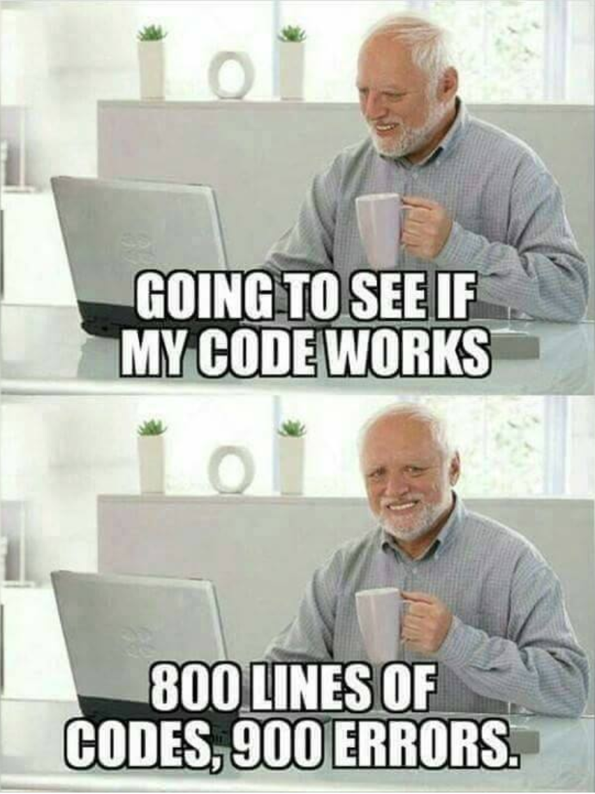
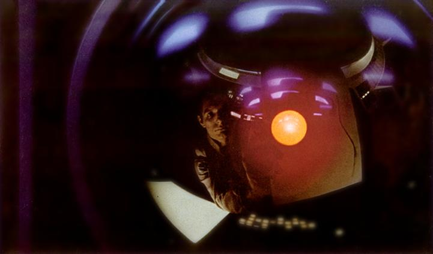
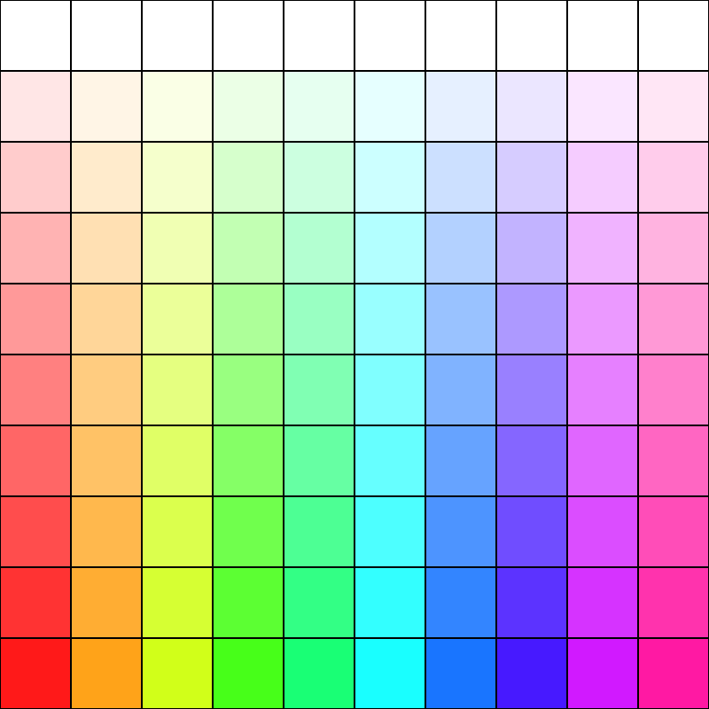

## 前回のおさらい 1/1

### 条件分岐（ `if` 文 ）
ある**特定の条件**を満たした場合にのみ実行させたい処理がある場合、
`if` 文で条件分岐を行う。

```js
if (条件式) {
  // 実行内容
}
```

`()` 内に書かれた `条件式` が **正しい** なら `{ }` 内のコードが実行される。
逆に、`条件式` が **正しくない** のなら `{ }` 内は実行されない。

---

### 真偽値
条件式が「正しい」状態を **真 (true)** と呼ぶ。
逆に、「正しくない」状態は **偽 (false)** と呼ぶ。
そして、これら二つの状態をまとめて **真偽値 (Boolean)** と呼ぶ。

---

#### 条件式の記述例
```js
if (x < y) {  // x が y よりも小さければ 真
if (x > y) {  // x が y よりも大きければ 真
```

`=（イコール）` 記号を含む条件式:

```js
if (x == y) {  // x が y と等しければ 真
if (x != y) {  // x が y と等しくなければ 真
if (x <= y) {  // x が y 以下なら 真
if (x >= y) {  // x が y 以上なら 真
```

---

# 繰り返し処理

---

### （突然ですが）線を一本引いてみよう。
線を引くには [`line`](https://p5js.org/reference/p5/line/) 関数を使う。

```js
function draw() {
  // 座標(200, 100) から (200, 300) へ線を引く
  line(200, 100, 200, 300);
}
```

---

### 線を増やそう
今度は 10px 右にずらして、一本目と平行な線を引こう。

```js
function draw() {
  line(200, 100, 200, 300); // 一本目
  line(210, 100, 210, 300); // 二本目
}
```

一本目をコピー＆ペーストして、パラメタを少し変えれば簡単だ。
同じやり方で、平行線を*あと三本*ほど追加してみほしい。

このような数本の平行線を描くだけのプログラムであれば、
数秒で書きあげることができるはずだ。

---

## では「100 本の線を引け」と言われたらどうする？ :thinking:

---

## コピー＆ペーストの弊害と潜在的リスク
`line()` 関数の呼び出しを 100 本分コピー＆ペーストし、一つ一つパラメタを調節すれば確かにこの要望は満たせるが、このやり方にはいくつかの**リスク**が存在する。

```js
function draw() {
  line(200, 100, 200, 300); // 一本目
  line(210, 100, 210, 300); // 二本目
  line(220, 100, 210, 300); // 三本目
  line(230, 100, 210, 300); // 四本目
  line(240, 100, 210, 300); // 五本目
  line(250, 100, 210, 300); // 六本目
  line(260, 100, 210, 300); // 七本目...😩
  ...
}
```

---

一つは*誤入力やバグなどの**ヒューマンエラー***に伴うリスクだ。
一つでもパラメタに間違った数値を入力してしまった場合、後で修正点を精査するのは手間がかかるだろう。また、コピー元のコードに問題があることが後で発覚した場合、コピー分のコードも全て手作業で修正しなくてはならない。



---

<div class="bg white">

もう一つは**仕様変更**に伴うリスクだ。例えば、先ほどの 100 本の平行線の間隔を 10 px から 12 px に変更してほしいと要求された場合のことを想像してほしい。

すでに要望通りのプログラムが書けていたとしても、その*要望が後から変更される可能性*は常に考慮に入れておくべきだ。何故なら我々人間を取り巻く環境は常に移ろい変化していくものだからだ。環境が変化すれば人の心もまた変わる。その変化を未来に渡って正確に予測する能力を我々は持たない。

同じコードのコピーを作るということは、仕様変更が発生した際、**コピーした分だけ修正作業に手間取られる**羽目になることを意味する。プログラマーがコピー＆ペーストを繰り返すほど、未来に起こり得る変化に対応しにくいプログラムができてしまうといえる。

</div>


---

## 人は完璧な存在ではない
ここで重要なのは、「**ヒューマンエラーや仕様変更の発生は必然であり、避けられない事象である**」ということを認識することだ。問題を認め、正面から向き合うことで初めて意義のある対策を講じることができると私は考える。

ところでプログラマーは我々人間だが、プログラムを動かすのはコンピューター、計算機だ。彼らは与えられた計算式を*瞬時に正確に*解くことができ、その仕事ぶりに「*誤り*」という言葉は無い。
プログラムにバグやエラーが発生するのは主に人間の書いたコードに原因があり、コンピューターには何の罪も無い。



---

## “*Don't Repeat Yourself.*”
一方でプログラマーの仕事とは、コードを介して**コンピューターに仕事を命令**することだ。
そしてコピー＆ペーストという*単純作業の繰り返し*は、*プログラマーの本分*とは言えない。
コンピューターに**繰り返しを命令**することが正しいプログラミングのあり方と言えよう。

<br>

> “*Don't Repeat Yourself.*”
> 繰り返すのはあなた（プログラマー）ではない。

<div style="text-align:right">

<small>参照: https://e-words.jp/w/DRY%E5%8E%9F%E5%89%87.html</small>

</div>

---

# ループ構文
プログラムに**同じ処理を複数回**実行させるために、
どんなプログラミング言語にもほぼ必ず存在するのが「**ループ構文**」だ。
これから JavaScript におけるループ構文を解説していく。

---

## `for` 文
**`for` 文** は、特定の処理を**決められた回数だけ繰り返し**実行させたい際に用いられるループ構文だ。

#### 書き方:
```js
for (let i = 0; i < ループ回数; i++) {
  // 実行したい処理
}
```

`ループ回数` に `100` と入れれば、`{ }` 内に書いたコードが 100 回実行される。

---

### `for` 文を紐解く
`for` に続く `( )` の中に注目してほしい。

```js
for (let i = 0; i < 100; i++) {
```

この `( )` の中身は `;`<small>（セミコロン）</small>を挟んで、以下の **3 つのパート** に分けられる。

<div class="cols gap">

<div>

```js
let i = 0
```

1. <span class="red">左のパート</span>
</div>
<div>

```js
i < 100
```

2. <span class="green">中央パート</span>
</div>
<div>

```js
i++
```

3. <span class="blue">右のパート</span>
</div>

---

プログラムが `for` の行に到達すると、*最初に左のパートが一回だけ実行*される。

```js
let i = 0  // 左: 変数 i の宣言
```

中央は *条件式* で、**ループを継続するか否かの条件判定** を行っている。

```js
i < 100    // 中央: i が 100 より小さければループ継続
```

右は **ループ毎に一回実行** される。

```js
i++        // 右: i を 1 増やす
```

---

変数 `i` は **ループ回数を数えるための変数** でループカウンターと呼ばれる。
ループを実行する度に `i` は 1 増えてゆき、
100<small>（ループ回数）</small>に到達した時、条件式 `i < 100` が *偽 (False)* になるため、
そこでループは終了する、というわけだ。

まとめると次の表のようになる。

---

| 実行順 | 実行コード | 実行内容 |
|:---:|:----|:----|
| 1. | `for` | ループ制御開始 |
| 2. | <code class="red">let i = 0</code> | <small class="red">左のパート:</small> ループカウンタの宣言 |
| 3. | <code class="green">i < 100</code> | <small class="green">中央パート:</small> 条件判定（条件に合致しなければここで `for` 文を終了する） |
| 4. | `{ ... }` | `{ }` 内の処理の実行 |
| 5. | <code class="blue">i++</code> | <small class="blue">右のパート:</small> ループカウンタに +1 |
| 6. | - | 3. に戻る |

```js
for (let i = 0; i < 100; i++) {
  // 繰り返し
}
```

---

ちなみに、ループカウンターの変数名が `i` である必要は特にない。
単なる変数名なので実は*何でもいい*。

とはいえ慣習的に `i` が使われることが多い。その由来は *iterator（イテレーター, 反復子）*、
あるいは *index（インデックス, 指数）* の頭文字であると言われている。

---

### 演習:
`for` 文を使って、**縞模様** を描いてみよう。
（質問、アドバイス受け付けます。）

---

## `for` 文を活用して、カラーパレットを描画してみよう
ループ構文を用いることで、一定のルールに基づいた規則性のある模様を、
ほんの数行のコードで描くことができる。

縞模様を描くプログラムを応用して、今度はキャンバス一杯にカラーパレットを描いてみよう。

---

<div class="cols c12 gap">



<div>

目標とするのはこのようなシンプルな二次元カラーパレットだ。

**横軸が色相 (Hue)** を表しており、左端が 0° = 赤で、右に行くにつれて 360° に近づいていく。

**縦軸は彩度 (Saturation)** を表しており、上端が 0% = 白で、下に行くにつれて 100% に近づいていく。

*明度 (Brightness)* はどの位置でも最大の 100% だ。

キャンバスサイズは 400 x 400 で、
各セルのサイズは 40 x 40 としよう。

</div>
</div>

<!-- 2024/12/10 講義 ここまで -->

---

# 高度な条件分岐

---

### `else` 句
`if` 文を使い条件分岐が行えることを学んだ。
`if` 文の直後に **`else`** 句を付帯させると、
逆に、**条件に合致しなかった場合** に実行させるコードを記述することができる。

---

### `else` 句の書き方<small>（例）</small>
```js
if (x < y) {
  // 真 の場合
  alert('X は Y より小さい。');

} else {
  // 偽 の場合
  alert('X は Y より小さくない。');
}
```

上記のコードは、
`x < y` が *真 (true)* なら上の `alert` が実行され、
`x < y` が *偽 (false)* なら下の `alert` が実行される。

---

`else` 句は、必ず **`if` 文の直後に付帯**するもので、
**`else` 句単体で記述することはできない**。

```js
// これは構文エラー
else {

}
```
```js
// これは OK
if (a == b) {

} else {

}
```

---

### `else if` 句
`else if` 句で、**さらに条件分岐を追加** することもできる。

```js
if (x < y) {
  alert('X は Y より小さい。');

} else if (x > z) {
  alert('X は Y より小さくない。');
  alert('X は Z より大きい。');
}
```

この場合、最初の `if` が *偽 (false)* の時のみ、
`else if` の条件判定が行われる。

どちらの条件にも合致しなかった場合は、何も実行されない。

---

複数の `else if` を繋げて、
**3つ以上の条件分岐** をつくることも可能。
```js
if (pet == 'dog') {          // 分岐:1
  alert('🐶 ワン');

} else if (pet == 'cat') {   // 分岐:2
  alert('🐱 ニャー');

} else if (pet == 'mouse') { // 分岐:3
  alert('🐭 チュー');

} else { // いずれの条件も満たさなかった場合
  alert('❓❓❓');
}
```

サンプルスケッチで確認してみよう。
https://editor.p5js.org/amekusa/sketches/3YAjHkOI-

---


# Appendix: 役に立つ関数, 変数

---

```js
random(最小値, 最大値);
```

`最小値` から `最大値` までの間で、ランダムな数値<small>（乱数）</small>を生成する。
生成された数値を *変数に入れたり*、
*別の関数の引数として利用* したりすることができる。

用例:
```js
let size = random(50, 60);
circle(10, 20, size);  // 50〜60 までのランダムなサイズ
```

---

```js
translate(X, Y);
```

描画原点をずらす関数。
通常、描画原点<small>（座標: 0, 0）</small>はキャンバスの左上に設定されているが、
この関数を呼ぶことで、引数の `X`, `Y` 分だけ描画原点をずらすことができる。
`circle()` や `text()` といった*全ての描画命令*は、この影響を受ける。
**キャンバスそのものをずらす** というイメージに近い。

用例:
```js
translate(100, 200);
circle(0, 0, 50); // 位置: 100, 200 に円描画
```

---

```js
push();
```

キャンバスの状態を一時的に保存する。
`translate()` 関数でずらしたキャンバスの位置も保存される。

<hr>

```js
pop();
```

最後に保存したキャンバスの状態に戻す。

---

用例:
```js
push(); // キャンバスの初期位置を保存

translate(100, 200); // キャンバスをずらす
circle(0, 0, 50);    // 位置: 100, 200 に円描画

pop(); // キャンバスを初期位置に戻す
```

---

```js
mouseX
mouseY
```

現在のマウスカーソルの X 座標, Y 座標 が入っている変数。

用例:
```js
circle(mouseX, mouseY, 50); // マウスカーソルの位置に円描画
```

---

参考書籍のコード
http://www.bnn.co.jp/support/generativedesign_p5js/

