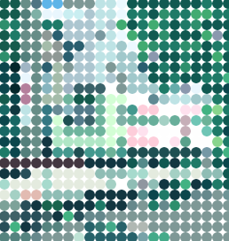

!DRAFT START: README_04 から移動 @2024/12/02 >>>

## 前回のおさらい 2/2

### ループ処理（ `for` 文 ）
同じ処理を一定の回数分だけ **繰り返し実行** させたい場合は `for` 文を使う。
仮に、`alert` 関数を 5 回繰り返す場合は以下のような記述になる。

```js
for (let i = 0; i < 5; i++) {
  alert(i + '回目'); // '0回目', '1回目', '2回目' ...
}
```

変数 `i` は **ループカウンター** と呼び、**`{ }` 内が実行される度に `+1`** される。
そして、`i` が `5` になると `for` 文は終了する。

---

### `for` 文の動作原理
```js
// 例: 100 回ループさせる場合
for (let i = 0; i < 100; i++) {
  （省略）
}
```

`( )` の中身は `;`<small>（セミコロン）</small>を挟んで、以下の **3 つのパート** に分けられる。

```js
let i = 0  // 左: 最初に一回だけ実行される
```

```js
i < 100    // 中央: { } 内を実行するか否かの条件式
```

```js
i++        // 右: ループ毎に実行される
```

---

まとめるとこうなる。
| 実行順 | 内容 |
|:---:|:----|
| 1. | `for` の行に到達 |
| 2. | <small>左のパート:</small> ループカウンタの宣言 |
| 3. | <small>中央パート:</small> 条件判定（条件が 真 でなければ `for` 文を終了する） |
| 4. | `{ }` 内のコードの実行 |
| 5. | <small>右のパート:</small> ループカウンタに +1 |
| 6. | 3. に戻る |

<<<!DRAFT END: README_04 から移動

---

## 前回のおさらい 1/3

### `else`
**`else`** 句は **`if` 文の直後**に書くことで、
**条件を満たさなかった場合**の実行内容を記述することができる。

```js
if (条件A) { // もし A が 真 なら
  alert('A');

} else {    // そうでないなら
  alert('Not A');
}
```

---

### `else if`
**`else` の直後に `if` 文**を書くと、
**別の条件分岐**を付加することができる。

```js
if (条件A) {
  alert('Aは真'); // 条件A == true

} else if (条件B) {
  alert('Aは偽'); // 条件A == false
  alert('Bは真'); // 条件B == true
}
```

---

**複数の `else if` 文を連鎖**させることも可能。
条件は上から順番にチェックされるので、
**下の条件ほど優先度が低くなる**といえる。

```js
if (条件A) {
  alert('Aは真'); // 条件A == true

} else if (条件B) {
  alert('Aは偽'); // 条件A == false
  alert('Bは真'); // 条件B == true

} else if (条件C) {
  alert('Aは偽'); // 条件A == false
  alert('Bも偽'); // 条件B == false
  alert('Cは真'); // 条件C == true
}
```

---

サンプルスケッチで、
**`if`, `else`, `if else`** の書き方と動作をもう一度確認してみよう。
https://editor.p5js.org/amekusa/sketches/3YAjHkOI-

---

## 前回のおさらい 2/3

### オブジェクト (Object)
データで表現されるバーチャルな “モノ”

---

オブジェクトとは**データ型**の一つで、
**複数の属性（プロパティ）**
によって構成された、情報の一単位である。

```js
let apple = {
  color:   'red'  // 色
  size:    11,    // 大きさ
  weight:  400,   // 重さ
};
```

オブジェクトも、数値や文字列と同様に
**変数に代入することができる**。


---

オブジェクトのプロパティは、**変数とほぼ同じ**ように使うことができる。
プロパティを参照するには **`オブジェクト.プロパティ名`** と書く。

```js
alert( 'この林檎の、' );
alert( '大きさは' + apple.size + 'cmです。' );
alert( '重さは' + apple.weight + 'グラムです。' );
```

---

プロパティの**値を変更**したり、
新しく**プロパティを追加**することも可能。

```js
let obj = {};     // 空のオブジェクトを作成
obj.x = 300;      // プロパティ x を追加
obj.x = 300 + 33; // x の値を変更
```

---

## 前回のおさらい 3/3

### 配列 (Array)
一度にたくさんの変数を扱うために

---

配列とは **特殊なオブジェクト** の一つ。
通常の変数が一つしか値を格納できないのに対して、
**配列は複数の値を保持**することができる。

配列を定義するには、
**`[ ]`** の中に **`,（カンマ）` 区切り**で値を列挙する。

```js
let students = ['Alice', 'Bob', 'Charles']; // 3人の生徒
```

---

配列に入れた**個々の値**のことを **要素 (Element)** と呼ぶ。
特定の要素にアクセスするには、その要素が**先頭から何番目**にあるかを指定する。

```js
alert( students[0] ); // Alice
alert( students[1] ); // Bob
alert( students[2] ); // Charles
```

この番号は **添字 (Index)** と呼ばれ、**`0` から始まる連番** となっている。

<figure>
<div class="array">
  students
  <div class="item a">[0] Alice</div>
  <div class="item b">[1] Bob</div>
  <div class="item c">[2] Charles</div>
</div>
<style scoped>
.array {
  display: flex;
  gap: 1em;
  align-items: center;
  justify-content: center;
  padding: 1em;
  /* background: hsl(40, 80%, 90%); */
  border: 1px dashed #0008;
  font-family: Menlo, Monaco, monospace;
}
.item {
  padding: .5em 1em;
}
.item.a {
  background: hsl(0, 90%, 80%);
}
.item.b {
  background: hsl(90, 90%, 80%);
}
.item.c {
  background: hsl(180, 90%, 80%);
}
</style>
<figure>

---

**`for`** 文によるループを活用すれば、
配列の**各要素**に対して **同じ処理を適用** させることができる。

```js
for (let i = 0; i < 3; i++) {
  alert( i + '番 ' + students[i] ); // 添字に i を指定
  // '0番 Alice'
  // '1番 Bob'
  // '2番 Charles'
}
```

---

配列に **後から要素を追加** するには **`push()`** 関数を使う。

```js
students.push( 'David' ); // David を生徒に追加
```

`push()` 関数は **最後尾に要素を追加** するので、
`students` 配列の内容は以下のようになる。

```js
['Alice', 'Bob', 'Charles', 'David']
```

---

配列に **全部でいくつの要素が入っているか** は
**`length`** プロパティで知ることができる。

```js
alert( '生徒は全部で' + students.length + '人います。' ); // '生徒は全部で4人います。'
```

```js
for (let i = 0; i < students.length; i++) {
  alert( i + '番 ' + students[i] ); // 添字に i を指定
  // '0番 Alice'
  // '1番 Bob'
  // '2番 Charles'
  // '3番 David'
}
```

---

### 配列の応用例
`05/rainbow-array.js`
https://editor.p5js.org/amekusa/sketches/UMign2Qg4

### 配列とオブジェクトの応用例
`05/rainbow-array-2.js`
https://editor.p5js.org/amekusa/sketches/OrVlqvNT7

---

# 外部ファイルを読み込む

---

## 画像を読み込む
p5.js において、画像は **オブジェクト** として取り扱う。
**`loadImage()`** 関数に読み込みたい画像のパスを渡すと、
**画像オブジェクト** が返り値として戻ってくる。

```js
let img; // 画像オブジェクトを入れる変数（変数名は自由）

function preload() {
  img = loadImage('画像ファイルへのパス');
}
```

注意点として、このような外部ファイルの読み込み処理は
必ず **`preload()` 関数内で行う**必要がある。

`preload()` 関数は `setup()` 関数よりも先に実行される。

---

読み込んだ画像オブジェクトを単純に表示するだけなら
**`image()`** 関数を使えば良い。

```js
image(img, 10, 20); // img を 座標:(10, 20) に表示
```

第 1 引数に表示したい画像オブジェクト,
第 2, 第 3 引数は表示したい位置 (X, Y) を渡す。

---

`image()` 関数はさらに詳細な引数の指定が可能だ。

```js
image(img,  x, y,  w, h,  dx, dy,  dw, dh);
```

| 引数 | 意味 |
|:----|:----|
| `x`, `y` | 表示位置 |
| `w`, `h` | 表示サイズ |
| `dx`, `dy` | 画像切り取り始点 |
| `dw`, `dh` | 画像切り取り幅, 高さ |

---

### サンプルコード
`image()` 関数を使って簡単な *アニメーション* を実装してみたので、
参考にしていただきたい。

`05/WalkingKirby`
https://editor.p5js.org/amekusa/sketches/tUNf8Mhev

---

今度は画像をそのまま表示するのではなく、
読み込んだ**画像データを元に、複雑な処理**を施してみよう。

---

そもそも、画像データとはどのようなデータだろうか。

デジタルデータとしての画像とは、
**整列した画素（ピクセル）の集合** にほかならない。
そして、ピクセルとは **RGB 値で表現される色** のデータである。

つまり、デジタル画像とは **色の集合** なのだ。



---

プログラムにおいて **集合<small>（複数のモノの集まり）</small>** を扱いたい場合は、
**配列** を用いるのが手っ取り早い。


---

**`loadImage()`** 関数から返ってくる画像オブジェクトも、
内部の **プロパティ** に **配列として色のデータ** を保持している。

この配列にアクセスするには、まず **`img.loadPixels()`** 関数を呼んでから
**`img.get()`** 関数を呼べばよい。

---

```js
img.loadPixels();
let c = img.get(0, 0); // 位置(0, 0) の色を取得
```

**`img.get()`** 関数は **画像上の指定された位置の色** を取得し、
オブジェクトとして返してくれる。(左上が 0, 0）

---

取得した **色オブジェクト** は
**`fill()`** や **`stroke()`** などの関数に渡すことで
**描画色** として利用することが可能だ。

```js
img.loadPixels();
let c = img.get(0, 0);

fill(c); // 塗りの色を c の値に設定
circle(mouseX, mouseY, 10); // 円描画
```

---

サンプルコードを見てみよう。

`05/ColorPicker/sketch.js`
https://editor.p5js.org/amekusa/sketches/-iyVpSKwJ

---

画像の *幅と高さ* が知りたい場合は、
**`img.width`** と **`img.height`** プロパティで取得できる。

これらを `for` 文と組み合わせると、**画像全体をピクセル単位で精査<small>（スキャン）</small>** し、
その情報を元に一風変わったエフェクトで画像を表示することができる。

---

参考として、8x8 の小さな画像を `for` 文でスキャンし、
**各ピクセルを円に置き換えて描画する** スケッチを用意した。

`05/PixelKirby/sketch.js`
https://editor.p5js.org/amekusa/sketches/1_XSnQ1iC

---

`for` 文と配列, オブジェクトを活用したサンプルコードも用意した。
**各ピクセルをオブジェクトに変換**している点に注目してもらいたい。

二つめのサンプルは、それらオブジェクトに**独立した挙動**を持たせ、
*群体アニメーション* のような動きを実現している。


`05/Pic-Cells/sketch.js`
https://editor.p5js.org/amekusa/sketches/0XDQSWwub

`05/Pic-Cells2/sketch.js`
https://editor.p5js.org/amekusa/sketches/AbSwnPIGp

---

## サウンドライブラリを使おう
波形を解析してビジュアライザを作ってみよう

---

p5.js は **サウンド** を扱うことも可能だ。
まずはサウンドファイルを読み込んで再生してみよう。

```js
let snd; // サウンドオブジェクトを入れる変数（変数名は自由）

function preload() {
  snd = loadSound('サウンドファイル');
}
```

画像を読み込む際と流れは同じだが、
`loadImage()` の替わりに、**`loadSound()`** 関数使う。

ファイル形式は **`.mp3` を使うのが無難** だろう。

---

読み込んだサウンドオブジェクトを再生するには
**`snd.play()`** 関数を呼べばいい。

```js
function setup() {
  createCanvas(400, 400);

  // サウンド再生
  snd.play();
}
```

再生をやめるには **`snd.stop()`** 、
一時停止は **`snd.pause()`** 関数だ。

---

`snd.play()` 関数は、
引数を与えることで *再生速度* や *音量* などを変えることもできる。

例:
```js
snd.play(
  0,  // 再生までのディレイ（秒）
  1,  // 再生速度
  1,  // 音量
  0,  // 再生開始時間（秒）
  2   // 再生時間（秒）
);
```

---

身の回りの環境音を録音して、*効果音* として使ってみるのもよいだろう。

### サンプルコード
sound-effect
https://editor.p5js.org/amekusa/sketches/76cypcHJd

`05/King-Kong-Kung/sketch.js`
https://editor.p5js.org/amekusa/sketches/ZzGm48DHc

---

## サウンド波形を解析する
ただ再生するだけではなく、
**再生中のサウンドに反応** して見た目が変化するようなスケッチを書いてみよう。

---

### 音
我々が音を認識できるのは、
音の発生源の **振動** が周囲の **空気に波** を作り、
その波が耳の奥の **鼓膜を振動** させるからだ。

また、その **振動の速さやリズム, 大きさ等** によって
様々な種類の音を識別することができる。


---

様々な振動のパターンが描く **波の形** を記録したのがサウンドファイルだ。
我々はその波形を数学的に **解析** することで、
その音に記録された **あらゆる詳細な情報** を取得することができる。

その情報を **プログラムの動作にフィードバック** させれば、
**音と一体となった** 面白いインタラクティブアートが創出できるかもしれない。


---

#### 音圧を取得する
`05/MusicPlayer/sketch.js`
https://editor.p5js.org/amekusa/sketches/-5YQoKdUJ

#### 定位の移動, 波形の表示
`05/MusicPlayer2/sketch.js`
https://editor.p5js.org/amekusa/sketches/uCmyFkJ8F

---

## マイク入力を取得する
PC のマイク入力を取得するには、まず以下のような手順が必要となる。

```js
let mic;

function setup() {
  let canvas = createCanvas(400, 400);
  // クリックしたらマイク使用許可
  canvas.mousePressed(userStartAudio);
  // マイクオブジェクトを生成, 変数に格納
  mic = new p5.AudioIn();
  // マイク起動
  mic.start();
}
```

---

あとは `mic.getLevel()` 関数でマイクの現在の **入力レベル** が取得できる。
入力レベルは `0.0` から `1.0` までの数値だ。

```js
function draw() {
  let level = mic.getLevel();
}
```

これを利用し、
**環境音に反応して何かが起こる** スケッチを描いてみてはいかがだろうか。

---

サンプル: Laughing Wave
https://editor.p5js.org/amekusa/sketches/tKPJc8sBx

---

サウンドのプログラミングは奥が深く、当講義で全てを網羅することはできない。
しかし、当講義で紹介した方法だけでも**アイディア次第**で多くの可能性を見出せるはず。

興味が湧いたのなら、
p5.js のサウンドライブラリのリファレンスに目を通すことをお勧めする。
https://p5js.org/reference/#/libraries/p5.sound


---

## タイポグラフィ

---

p5.js はフォントを扱うこともできる。
フォントファイルを読み込むには **`loadFont()`** 関数を使えばよい。

```js
let font; // フォントオブジェクトを入れる変数

function preload() {
    font = loadFont('フォントファイル');
}
```

対応しているフォントのファイル形式は **`.ttf` か `.otf`** のみだ。

まずはライセンスフリーのフォントで使いたいものを探してみよう。
https://www.fontsquirrel.com/

---

読み込んだフォントオブジェクトを使用するには **`textFont()`** 関数を呼ぼう。

```js
textFont(font);
text('Hello p5.js !');
```

`textFont()` 関数の引数にフォントオブジェクトを渡し、
**`text()`** 関数で任意の文字列を描画する。

---

フォントオブジェクトの **`textToPoints()`** 関数は
**テキストのアウトラインデータ** を取得する関数だ。
アウトラインデータは **全ての頂点の位置** を示した **配列** だ。
使い方についてはサンプルコードを参照していただきたい。

`05/Typography/sketch.js`
https://editor.p5js.org/amekusa/sketches/XcKPoUYOH

---

#### サンプル集 by 講師:相馬
https://editor.p5js.org/amekusa/collections/9jwIe3hqu

#### 参考書籍のコード
http://www.bnn.co.jp/support/generativedesign_p5js/

---

# Appendix: 便利な関数

---

```js
map(value,   start1, stop1,   start2, stop2);
```

`start1` ~ `stop1` の値の範囲内にある `value` の値を、
`start2` ~ `stop2` の値の範囲内に収まるよう変換する。

例:
```js
let v = map(3,   0, 10,   0, 100); // 変数 v には 30 が入る
```
```js
let v = map(0.5,   0, 1,   50, 100); // 変数 v には 75 が入る
```

---

例えば、`mic.getLevel()` で取得できる値は `0.0 ~ 1.0` だが、
`map()` を使って、この値を `0 ~ 255` の値に変換することができる。

```js
// 0 から 1
let level = mic.getLevel();

// 0 から 255 に変換
let bg = map(level,   0, 1,   0, 255);

// マイクレベルに応じて背景が黒から白に変動する
background(bg);
```

---

# Appendix: 省略記法

---

変数 `x` の値を `1` 増やすには、

```js
x = x + 1;
```

...と書くが、これは、

```js
x++;
```

...と書いても同じである。

---

変数 `x` の値を `y` 増やすには、

```js
x = x + y;
```

...と書くが、これは、

```js
x += y;
```

...と書くこともできる。

足し算だけではなく、
掛け算など、他の演算においても同じルールが適用できる。

