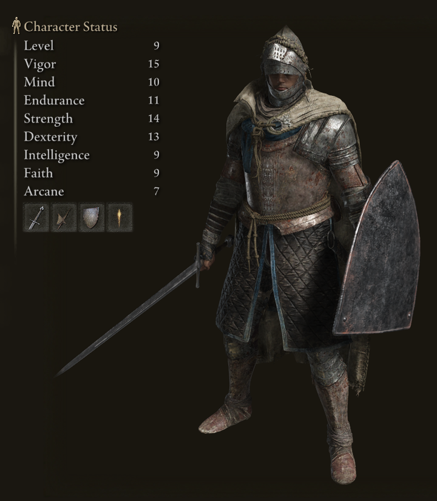

## 前回のおさらい

### ループ処理（ `for` 文 ）
同じ処理を一定の回数分だけ**繰り返し**実行させたい場合は `for` 文を使う。
例えば以下のコードでは `alert` 関数が *5* 回繰り返し実行される。

```js
for (let i = 0; i < 5; i++) {
  alert(i + '回目'); // '0回目', '1回目', '2回目' ...
}
```

変数 `i` は*ループカウンター*と呼び、**`{ }` 内が実行される度に `+1`** される。
そして、`i` が `5` になると `for` 文は終了する。

---

### `for` 文の動作原理
以下は 100 回ループする `for` 文の例だ。

```js
for (let i = 0; i < 100; i++) {
  // 繰り返し
}
```

`for` に続く `( )` 内は、`;` を挟んだ **3 つのパーツ**に分けられる。

<div class="cols gap">

<div>

```js
let i = 0
```

1. 左パート
</div>
<div>

```js
i < 100
```

2. 中央パート
</div>
<div>

```js
i++
```

3. 右パート
</div>

---

| 実行順 | 実行コード | 実行内容 |
|:---:|:----|:----|
| 1. | `for` | ループ制御開始 |
| 2. | `let i = 0` | <small>左のパート:</small> ループカウンタの宣言 |
| 3. | `i < 100` | <small>中央パート:</small> 条件判定（条件に合致しなければここで `for` 文を終了する） |
| 4. | `{ ... }` | `{ }` 内の処理の実行 |
| 5. | `i++` | <small>右のパート:</small> ループカウンタに +1 |
| 6. | - | 3. に戻る |

```js
for (let i = 0; i < 100; i++) {
  // 繰り返し
}
```

---


# オブジェクト (Object)
プロパティで表現される、バーチャルな “モノ”

---

*「物」は単一の数値では表現できない。*
どんなに単純な物体でも
色, 形, 大きさ, 重さ
といった、*多面的な情報の集合*から成り立っている。


---

そのような「物」を JavaScript で表現するには
**オブジェクト (Object)** というデータ型を用いるのがよい。

（データ型とは、数値や文字列といった値のタイプ（種類）のこと。）

---

オブジェクトは通常、**1つ以上の属性（プロパティ）** から構成されており、
このような書式で定義することができる。

```js
{
  プロパティA: 値,
  プロパティB: 値,
  プロパティC: 値
}
```

プロパティ名は自由だ。<small>（ただし半角英数を推奨）</small>

---

例として一つの :apple: 林檎をオブジェクトとして記述してみよう。

```js
{
  color:  'red', // 色
  size:   11,    // 大きさ (cm)
  weight: 400    // 重さ (g)
}
```

このオブジェクトは `color`, `size`, `weight` という 3 つのプロパティで構成されている。

---

また、オブジェクトは変数に代入することが可能だ。

```js
let apple = {
  color:  'red', // 色
  size:   11,    // 大きさ (cm)
  weight: 400    // 重さ (g)
};
```

先ほどの :apple: 林檎オブジェクトを `apple` という変数に代入してみた。

---

**オブジェクトとプロパティ** の関係性は、
ゲームの **キャラクターとステータス値** の関係性に近い。

```js
// オブジェクト: プレイヤーキャラクター
let player = {
  name: 'John',  // 名前
  sex:  'male',  // 性別
  lv:     30,    // レベル
  exp:  1024,    // 経験値
  hp:    128,    // 体力
  str:    99,    // ちから
  agl:     8,    // 素早さ
  fth:    99,    // 信仰心
};
```



---

これまで、物体の描画位置やサイズなどの情報を表現する際、

```js
let x = 10;    // 円の x 座標
let y = 20;    // 円の y 座標
let size = 50; // 円の直径
```

このように *複数の変数* を使用してきたが、
オブジェクトを利用することで...

```js
// 円オブジェクト
let ball = {
  x: 10,    // x 座様
  y: 20,    // y 座標
  size: 50, // 直径
};
```

このように、各情報をオブジェクトのプロパティとしてまとめることができる。

---

変数に代入したオブジェクトのプロパティにアクセスするには、

```js
alert('ようこそ！ ' + player.name + 'さん'); // 'ようこそ！ Johnさん'
```

このように、`変数名.プロパティ名` と書けばよい。
それ以外のルールは **変数と全く同じ** なので、
*プロパティの値を増減させたり上書きすることが可能* である。

```js
player.lv++; // レベルアップ
```

```js
let dmg = 256;
player.hp = player.hp - dmg; // プレイヤーに 256 のダメージ
```

---

先ほどの円オブジェクトを `circle()` 関数で描画するなら、以下のようになる。

```js
// 円オブジェクト
let ball = {
  x: 10,    // x 座様
  y: 20,    // y 座標
  size: 50, // 直径
};

// 描画
circle(ball.x, ball.y, ball.size);
```

---

また、プロパティは **後から追加** しても問題ない。

```js
let ball = {};  // 空のオブジェクトを作成
ball.x = 10;    // プロパティ x を追加
ball.y = 20;    // プロパティ y を追加
```

---

サンプルスケッチを確認してみよう。
`04/balls.js` https://editor.p5js.org/amekusa/sketches/UulZcFAl-


改造版:
`04/bouncy-balls.js` https://editor.p5js.org/amekusa/sketches/_AV0PDuJr

---

# 配列 (array)

---

第二回目の講義で、
変数は **「値を一つだけ保存できる容れ物」** のようなものだと説明した。

先ほどのサンプルスケッチ内の**変数 `ballA`, `ballB`** のように、
**2 個のオブジェクトが必要なら 2 つの変数**を用意する必要がある。

---

もし同じ方法で **3 個目のボール**が欲しくなったら、
我々はさらに **変数 `ballC`** を用意しなくてはならない。

だが *“Don't Repeat Yourself”* の原則に立ち返るならば、
これは美しい解決方法とは言えない。

そこで **配列 (array)** の出番となる。

---

配列とは *特殊なオブジェクトの一種*で、
**複数の値を、それぞれに番号を振って格納, 管理**することのできる構造体である。

---

*貨物列車* をイメージしてほしい。
先頭の貨物は `0` 番で、その次は `1` 番, その次は `2` 番... という具合に、
**各貨物には連番が振られている。**
<figure>
<div class="array">
  配列
  <div class="item a">0番: 値A</div>
  <div class="item b">1番: 値B</div>
  <div class="item c">2番: 値C</div>
</div>
<style scoped>
.array {
  display: flex;
  gap: 1em;
  align-items: center;
  justify-content: center;
  padding: 1em;
  /* background: hsl(40, 80%, 90%); */
  border: 1px dashed #0008;
  font-family: Menlo, Monaco, monospace;
}
.item {
  padding: .5em 1em;
}
.item.a {
  background: hsl(0, 90%, 80%);
}
.item.b {
  background: hsl(90, 90%, 80%);
}
.item.c {
  background: hsl(180, 90%, 80%);
}
</style>
<figure>

そして、各貨物には一つづつ **値** を入れることができる。
貨物はそれぞれが **変数** のようなものだとも言える。

変数との違いは、**名前ではなく番号でアクセスする** という点だ。

---

配列を定義するには、

```js
[値A, 値B, 値C]
```

このように `[ ]` の中に **`,（カンマ）` 区切り**で値を列挙する。

```js
let list = ['Alice', 'Bob', 'Charles'];
```

この例では、**変数 `list`** に
**三つの文字列 `Alice`, `Bob`, `Charles` が入った配列** を代入している。

---

先ほどは "貨物" と例えたが、
配列に格納されている一つ一つの値は、正式には **要素 (element)** と呼び、
**番号を指定** してそれぞれの要素にアクセスすることができる。

```js
alert( list[0] ); // "Alice"
alert( list[1] ); // "Bob"
alert( list[2] ); // "Charles"
```

`[ ]` の数字が番号で、**`0` から始まる連番**となっている。
この番号は **添字（インデックス）** と呼ぶ。

---

ちなみに、値の列挙時に改行を挟んでも問題ない。
長い配列を定義する際は**読みやすさ**を心がけよう。

```js
// NATO フォネティックコード
let list = [
  'Alfa',
  'Bravo',
  'Charlie',

  'Delta',
  'Echo',
  'Foxtrot'
];
```

---

配列に**後から要素を追加**することも可能だ。
**`push()` 関数**を使うと、**配列の最後尾**に新しい要素を追加できる。

```js
list.push('Golf'); // Foxtrot の次
```

また、**`length` プロパティ** を参照することで、
*その配列内の要素の総数* を知ることもできる。

```js
alert( list.length ); // 7
```

---

### 配列をループで回そう
ここまで内容では配列の利点がこれといって思いつかないかもしれないが、
**添字で個々の要素にアクセスできる**という性質が
**`for` ループ**と組み合わせた時に**真価**を発揮する。

---

サンプルコードを確認しよう。
`04/array.js` https://editor.p5js.org/amekusa/sketches/_Y5ai80fH

---

早速、配列と `for` ループを駆使し、
2 個だったボールを **24 個** に増やしてみた。
コードと動作を確認してみてほしい。
`04/bouncy-balls-2.js` https://editor.p5js.org/amekusa/sketches/FIM3H8feO

---

## 演習:
サンプルコードを参考にしながら、
- オブジェクト (object)
- 配列 (array)
- `for` ループ

を駆使し、**動くアート**を作ってみよう。

---

# 外部ファイルを読み込む

---

## 画像を読み込む
p5.js において、画像は **オブジェクト** として取り扱う。
**`loadImage()`** 関数に読み込みたい画像のパスを渡すと、
**画像オブジェクト** が返り値として戻ってくる。

```js
let img; // 画像オブジェクトを入れる変数（変数名は自由）

function preload() {
  img = loadImage('画像ファイルへのパス');
}
```

注意点として、このような外部ファイルの読み込み処理は
必ず **`preload()` 関数内で行う**必要がある。

`preload()` 関数は `setup()` 関数よりも先に実行される。

---

読み込んだ画像オブジェクトを単純に表示するだけなら
**`image()`** 関数を使えば良い。

```js
image(img, 10, 20); // img を 座標:(10, 20) に表示
```

第 1 引数に表示したい画像オブジェクト,
第 2, 第 3 引数は表示したい位置 (X, Y) を渡す。

---

`image()` 関数はさらに詳細な引数の指定が可能だ。

```js
image(img,  x, y,  w, h,  dx, dy,  dw, dh);
```

| 引数 | 意味 |
|:----|:----|
| `x`, `y` | 表示位置 |
| `w`, `h` | 表示サイズ |
| `dx`, `dy` | 画像切り取り始点 |
| `dw`, `dh` | 画像切り取り幅, 高さ |

---

### サンプルコード
`image()` 関数を使って簡単な *アニメーション* を実装してみたので、
参考にしていただきたい。

`05/WalkingKirby`
https://editor.p5js.org/amekusa/sketches/tUNf8Mhev

---

今度は画像をそのまま表示するのではなく、
読み込んだ**画像データを元に、複雑な処理**を施してみよう。

---

そもそも、画像データとはどのようなデータだろうか。

デジタルデータとしての画像とは、
**整列した画素（ピクセル）の集合** にほかならない。
そして、ピクセルとは **RGB 値で表現される色** のデータである。

つまり、デジタル画像とは **色の集合** なのだ。


---

プログラムにおいて **集合<small>（複数のモノの集まり）</small>** を扱いたい場合は、
**配列** を用いるのが手っ取り早い。


---

**`loadImage()`** 関数から返ってくる画像オブジェクトも、
内部の **プロパティ** に **配列として色のデータ** を保持している。

この配列にアクセスするには、まず **`img.loadPixels()`** 関数を呼んでから
**`img.get()`** 関数を呼べばよい。

---

```js
img.loadPixels();
let c = img.get(0, 0); // 位置(0, 0) の色を取得
```

**`img.get()`** 関数は **画像上の指定された位置の色** を取得し、
オブジェクトとして返してくれる。(左上が 0, 0）

---

取得した **色オブジェクト** は
**`fill()`** や **`stroke()`** などの関数に渡すことで
**描画色** として利用することが可能だ。

```js
img.loadPixels();
let c = img.get(0, 0);

fill(c); // 塗りの色を c の値に設定
circle(mouseX, mouseY, 10); // 円描画
```

---

サンプルコードを見てみよう。

`05/ColorPicker/sketch.js`
https://editor.p5js.org/amekusa/sketches/-iyVpSKwJ

---

画像の *幅と高さ* が知りたい場合は、
**`img.width`** と **`img.height`** プロパティで取得できる。

これらを `for` 文と組み合わせると、**画像全体をピクセル単位で精査<small>（スキャン）</small>** し、
その情報を元に一風変わったエフェクトで画像を表示することができる。

---

参考として、8x8 の小さな画像を `for` 文でスキャンし、
**各ピクセルを円に置き換えて描画する** スケッチを用意した。

`05/PixelKirby/sketch.js`
https://editor.p5js.org/amekusa/sketches/1_XSnQ1iC

---

`for` 文と配列, オブジェクトを活用したサンプルコードも用意した。
**各ピクセルをオブジェクトに変換**している点に注目してもらいたい。

二つめのサンプルは、それらオブジェクトに**独立した挙動**を持たせ、
*群体アニメーション* のような動きを実現している。


`05/Pic-Cells/sketch.js`
https://editor.p5js.org/amekusa/sketches/0XDQSWwub

`05/Pic-Cells2/sketch.js`
https://editor.p5js.org/amekusa/sketches/AbSwnPIGp

---

## サウンドライブラリを使おう
波形を解析してビジュアライザを作ってみよう

---

p5.js は **サウンド** を扱うことも可能だ。
まずはサウンドファイルを読み込んで再生してみよう。

```js
let snd; // サウンドオブジェクトを入れる変数（変数名は自由）

function preload() {
  snd = loadSound('サウンドファイル');
}
```

画像を読み込む際と流れは同じだが、
`loadImage()` の替わりに、**`loadSound()`** 関数使う。

ファイル形式は **`.mp3` を使うのが無難** だろう。

---

読み込んだサウンドオブジェクトを再生するには
**`snd.play()`** 関数を呼べばいい。

```js
function setup() {
  createCanvas(400, 400);

  // サウンド再生
  snd.play();
}
```

再生をやめるには **`snd.stop()`** 、
一時停止は **`snd.pause()`** 関数だ。

---

`snd.play()` 関数は、
引数を与えることで *再生速度* や *音量* などを変えることもできる。

例:
```js
snd.play(
  0,  // 再生までのディレイ（秒）
  1,  // 再生速度
  1,  // 音量
  0,  // 再生開始時間（秒）
  2   // 再生時間（秒）
);
```

---

身の回りの環境音を録音して、*効果音* として使ってみるのもよいだろう。

### サンプルコード
sound-effect
https://editor.p5js.org/amekusa/sketches/76cypcHJd

`05/King-Kong-Kung/sketch.js`
https://editor.p5js.org/amekusa/sketches/ZzGm48DHc

---

## サウンド波形を解析する
ただ再生するだけではなく、
**再生中のサウンドに反応** して見た目が変化するようなスケッチを書いてみよう。

---

### 音
我々が音を認識できるのは、
音の発生源の **振動** が周囲の **空気に波** を作り、
その波が耳の奥の **鼓膜を振動** させるからだ。

また、その **振動の速さやリズム, 大きさ等** によって
様々な種類の音を識別することができる。


---

様々な振動のパターンが描く **波の形** を記録したのがサウンドファイルだ。
我々はその波形を数学的に **解析** することで、
その音に記録された **あらゆる詳細な情報** を取得することができる。

その情報を **プログラムの動作にフィードバック** させれば、
**音と一体となった** 面白いインタラクティブアートが創出できるかもしれない。


---

#### 音圧を取得する
`05/MusicPlayer/sketch.js`
https://editor.p5js.org/amekusa/sketches/-5YQoKdUJ

#### 定位の移動, 波形の表示
`05/MusicPlayer2/sketch.js`
https://editor.p5js.org/amekusa/sketches/uCmyFkJ8F

---

## マイク入力を取得する
PC のマイク入力を取得するには、まず以下のような手順が必要となる。

```js
let mic;

function setup() {
  let canvas = createCanvas(400, 400);
  // クリックしたらマイク使用許可
  canvas.mousePressed(userStartAudio);
  // マイクオブジェクトを生成, 変数に格納
  mic = new p5.AudioIn();
  // マイク起動
  mic.start();
}
```

---

あとは `mic.getLevel()` 関数でマイクの現在の **入力レベル** が取得できる。
入力レベルは `0.0` から `1.0` までの数値だ。

```js
function draw() {
  let level = mic.getLevel();
}
```

これを利用し、
**環境音に反応して何かが起こる** スケッチを描いてみてはいかがだろうか。

---

サンプル: Laughing Wave
https://editor.p5js.org/amekusa/sketches/tKPJc8sBx

---

サウンドのプログラミングは奥が深く、当講義で全てを網羅することはできない。
しかし、当講義で紹介した方法だけでも**アイディア次第**で多くの可能性を見出せるはず。

興味が湧いたのなら、
p5.js のサウンドライブラリのリファレンスに目を通すことをお勧めする。
https://p5js.org/reference/#/libraries/p5.sound


---

## タイポグラフィ

---

p5.js はフォントを扱うこともできる。
フォントファイルを読み込むには **`loadFont()`** 関数を使えばよい。

```js
let font; // フォントオブジェクトを入れる変数

function preload() {
    font = loadFont('フォントファイル');
}
```

対応しているフォントのファイル形式は **`.ttf` か `.otf`** のみだ。

まずはライセンスフリーのフォントで使いたいものを探してみよう。
https://www.fontsquirrel.com/

---

読み込んだフォントオブジェクトを使用するには **`textFont()`** 関数を呼ぼう。

```js
textFont(font);
text('Hello p5.js !');
```

`textFont()` 関数の引数にフォントオブジェクトを渡し、
**`text()`** 関数で任意の文字列を描画する。

---

フォントオブジェクトの **`textToPoints()`** 関数は
**テキストのアウトラインデータ** を取得する関数だ。
アウトラインデータは **全ての頂点の位置** を示した **配列** だ。
使い方についてはサンプルコードを参照していただきたい。

`05/Typography/sketch.js`
https://editor.p5js.org/amekusa/sketches/XcKPoUYOH

---

#### サンプル集 by 講師:相馬
https://editor.p5js.org/amekusa/collections/9jwIe3hqu

#### 参考書籍のコード
http://www.bnn.co.jp/support/generativedesign_p5js/

---

# Appendix: 便利な関数

---

```js
map(value,   start1, stop1,   start2, stop2);
```

`start1` ~ `stop1` の値の範囲内にある `value` の値を、
`start2` ~ `stop2` の値の範囲内に収まるよう変換する。

例:
```js
let v = map(3,   0, 10,   0, 100); // 変数 v には 30 が入る
```
```js
let v = map(0.5,   0, 1,   50, 100); // 変数 v には 75 が入る
```

---

例えば、`mic.getLevel()` で取得できる値は `0.0 ~ 1.0` だが、
`map()` を使って、この値を `0 ~ 255` の値に変換することができる。

```js
// 0 から 1
let level = mic.getLevel();

// 0 から 255 に変換
let bg = map(level,   0, 1,   0, 255);

// マイクレベルに応じて背景が黒から白に変動する
background(bg);
```

---

# Appendix: 省略記法

---

変数 `x` の値を `1` 増やすには、

```js
x = x + 1;
```

...と書くが、これは、

```js
x++;
```

...と書いても同じである。

---

変数 `x` の値を `y` 増やすには、

```js
x = x + y;
```

...と書くが、これは、

```js
x += y;
```

...と書くこともできる。

足し算だけではなく、
掛け算など、他の演算においても同じルールが適用できる。

